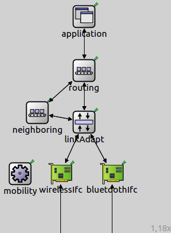
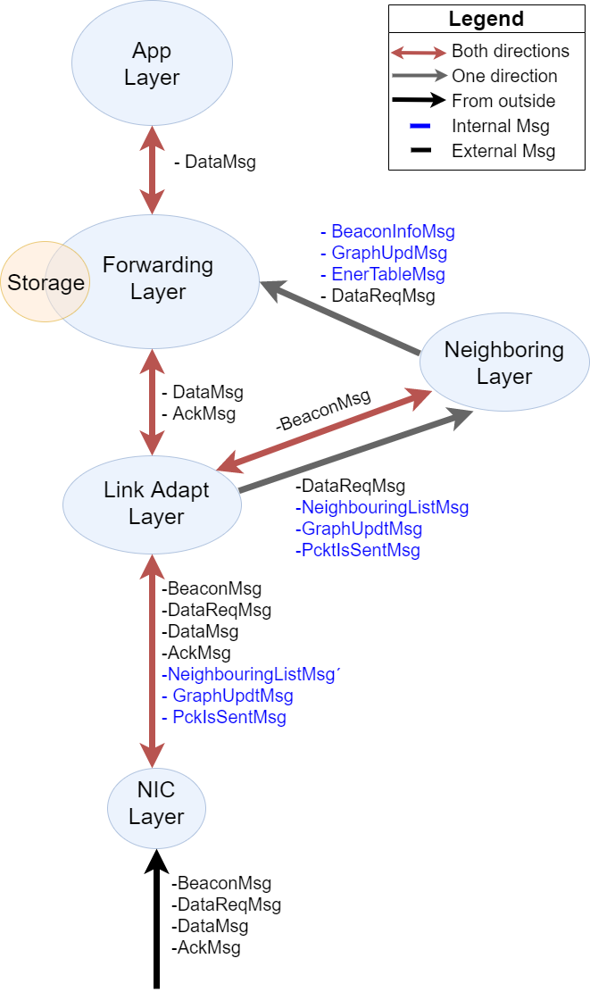

# OPAQS - Beta Version

The Opportunistic Aquatic Surface Vehicles Simulator, is a set of
simulation models in OMNeT++ to simulate opportunistic networks. It has a
modular architecture where different protocols relevant to opportunistic networks
can be developed and plugged in. OPAQS is a scaled-down, light-weight version.

The following sections provide details of the models available and about
the installation. OPAQS is meant to be run in the OMNeT++ IDE and as well as on 
the command-line**.

## Prerequisites

OPAQS requires OMNeT++ (version 5.4.1) and the INET Framework (version 4.0.0). 
The OMNeT++ simulator and the IDE can be found at the [OMNeT++ site](https://www.omnetpp.org). Once the
simulator and the IDE is installed, INET (version 4) has to be installed. It can be either 
installed through the IDE itself  or by downloading
from the [INET site](https://inet.omnetpp.org). Here are the 2 important prerequisites.

1. Install and build OMNeT++ (version 5.4.1)

2. Run the OMNet++ IDE and create a new workspace

3. Install and build INET (version 4.0.0) in the newly created workspace using
   option - `Help -> Install Simulation Models...` or another means (e.g., at workspace creation, using a downloaded archive, etc.)

## Installing OPAQS

Once OMNeT++ IDE and INET4 are installed and built, follows the following steps to install
[OPAQS](https://github.com/joaobcpatricio/OASSim). 

1. Download the Github repository of [OPAQS](https://github.com/joaobcpatricio/OAASSim)

2. If [OPAQS](https://github.com/joaobcpatricio/OASSim) downloaded as a ZIP file, expand the ZIP file

3. Run the OMNeT++ IDE, and import [OPAQS](https://github.com/joaobcpatricio/OASSim) (`File -> Import... -> General -> File System`) into the OMNeT++ workspace (where INET is also a project)

4. Tick INET as a referenced project (`Properties -> Project References`). Make the exact INET version installed is ticked (remove other ticks)

5. Build the OPAQS project using - `Project -> Build Project` (should not have any errors or warnings after building)

## Running OPAQS

To run simulation, check the `TormV1.ini` and the `NetworkTormV1.ned` given (in `simulations` folder), to create your own
scenario. Here are the basic steps

1. Run the OMNeT++ IDE and select the workspace where INET4 and OPAQS is installed and built

2. Modify the `TormV1.ini` to suit your scenario parameters

3. Select the OPAQS folder (the top most folder of the OPAQS project) and run using - `Run -> Run As -> OMNeT++ Simulation`

## Node Architecture

The architecture of a node uses a number of protocol layers which can be configured
based on the scenario considered. The node model is defined in the `OPSNode.ned` file.
Generally, an OPSNode has the following protocol layers.

                           +------------------------+
                           |  +------------------+  |
                           |  |Application Layer |  |
                           |  |                  |  |
                           |  +--------+---------+  |
                           |           |            |	+------------------------+
                           |  +--------+---------+  |	|  +--------+---------+  |
                           |  |     Routing      |----------|  |   Neighbouring   |  |
                           |  |      Layer       |  |	|  |       Layer      |  |
                           |  |+-------+         |  |       |  +----------|-------+  |
	                       |  ||Storage|         |  |       +-------------|----------+
			       |  |+-------+         |  |                     |
			       |  +--------+---------+  |	              |
                           |           |            |	              |
                           |  +--------+---------+  |                     |
                           |  | Link Adaptation  |------------------------/
                           |  |     Layer        |  |
                           |  +--------+---------+  |
                           |           |            |
                           |  +--------+---------+  |
                           |  |     NIC Layer    |  |
                           |  | +--------------+ |  |
                           |  | |   Mobility   | |  |
                           |  | +--------------+ |  |
                           |  +--------+---------+  |
                           +-----------|------------+
                                       |

Each of the above layers can be configured through their parameters to behave as required. Here are the models
associated with each layer.

1. Application Layer consist of the `AppLayer` application that receives the order to generate Data Messages.

2. Routing Layer consist of the `RoutingLayer` which is used to forward data
   in an opportunistic network, here diferent forwarding protocols can be used/tested (eg. Epidemic)

3. Neighbouring Layer consists of the `NeoghbouringLayer` where all the neighbours treatment is taken care,
   from the list of neighbours, to the graph of the network, that is, each node as a graph knowing the
   path to the nodes in the network and its estimated cost based on quality of connection (RSSI) and others.

4. Link Adaptation Layer is a simple pass-through layer (`LinkAdaptLayer`) that redirects internal messages 
   to the respective module.

5. Link Layer consist of the `WirelessInterface` and `BluetoothInterface` model that performs simple 
   wireless/bluetooth communications. Here we can also implement other network interfaces.
   
6. Mobility implements the movements of the mobile nodes in the scenarios. It can use any
   of the mobility models available in the INET4 Framework. In OPAQS, `TormV1.ini` is
   configured to use BonnMotion (`BonnMotionMobility`) mobility model. Some sample traces
   with SLAW mobility (`Moves4.movements`, ...) are available in the 
   `simulations` folder.

The following picture shows an example configuration of a node as seen in the OMNeT++ IDE.

  

The following picture shows an example of the flow of messages inside a node as seen in the OMNeT++ IDE.

  

## Checking Results

This part is not correctly working yet but will in a near future.

Based on the standard configuration, the raw results (vector and scalar) collected after a simulation run 
are located in the `simulation/results` folder. Below is a brief (high-level) procedure to create your charts
using the IDE. 

1. In the `simulation/results` folder, create an `Analysis File` (`New -> Analysis File (anf)`)
2. Add the created results files (`*.vec` or `*.sca`) to the created file
3. Create datasets with the data you want plotted in every graph
4. Plot them using an appropriate chart type (Line, Bar, etc.)

For more information, check Chapter 10 of the [IDE User Guide](https://www.omnetpp.org/doc/omnetpp/UserGuide.pdf)

## Important Model Parameters

The following list provides some of the most important parameters of the different models 
in OPAQS. All these parameters are configurable using the `TermV1.ini`. **Not all parameters 
are listed here**. Please check the respective model's `.ned` file to see all the parameters.

### Parameters in `NetworkTermV1.ned`

1. `numNodes` - The total number of nodes in the network
2. Network level statistics

### Parameters in `AppLayer.ned`

1. `dataGenerationInterval` - Defines how often (in seconds) a data gets injected into the network
2. `dataSizeInBytes` - The payload size in bytes of a data packet
3. `destinationAddr` - Destination of the msg (GW)
4. `destinationBTAdd` - Destination of the msg (GW)
5. `nodesThatGen` - Indicates if the following nodes are the ones that generate data (true) or that don't (false)
6. `nodesGenMsg` - The list of nodes that generate (true) or not (false) the data messages
7. `startMultipleMsg` - Set true if I want multiple messages to be generated at the beggining of the simulation
8. `numMultipleMsg` - Number of multiple messages to be generated at the beginning
9. `hopsListSize` - Maximum number of hops of Addresses a DataMsg can save

### Parameters in `RoutingLayer.ned`

1. `routingLayer` - Here we define the routing protocol file to be used (Eg."EpidemicRoutingLayer" )
2. `maximumHopCount` - The maximum hops that a data packet is allowed to travel (be forwarded) before being discarded

### Parameters in `NeighboringLayer`

1. `antiEntropyInterval` - Periodicity of beacons
2. `maximumRandomBackoffDuration` - #Time to start sending Messages
3. `delayPerDataMsg` - Estimation of 100ms of delay per data message
4. `sendWifiFirst` - Decides if is sending beacons through Wifi or BT	(by default sends beacons through wifi)

### Parametes in `Storage`

1. `maximumCacheSize` - The size of the cache maintained by each node in bytes

### Parameters in `NetworkInterface.ned`

1. `wirelessRange` - The wireless range of each node's wireless interface
2. `bandwidthBitRate` - Communication bit rate of the wireless interface
3. `neighbourScanInterval` - Period to updates the list of neighbors on the interface
4. `wirelessHeaderSize` -  802.11 a/b/c header  16byte for BT, 32 byte for Wifi
5. `wirelessIfc` - Set the minimum value of SSI to consider a valid connection/beighbor

## Help

If you have any question or clarifications related to OMNeT++, please check the documentation provided at the [OMNeT++ site](https://www.omnetpp.org) and
[INET](https://inet.omnetpp.org) sites. Here are the important documents.

1. OMNeT++ - [Install Guide](https://www.omnetpp.org/doc/omnetpp/InstallGuide.pdf), 
   [Simulation Manual](https://www.omnetpp.org/doc/omnetpp/SimulationManual.pdf), 
   [IDE User Guide](https://www.omnetpp.org/doc/omnetpp/UserGuide.pdf)

2. INET - [Documentation](https://inet.omnetpp.org/Introduction.html)

3. Results processing in OMNeT++ IDE - Chapter 10 of the [IDE User Guide](https://www.omnetpp.org/doc/omnetpp/UserGuide.pdf)

4. INET Mobility Models - [Node Mobility](https://inet.omnetpp.org/docs/users-guide/ch-mobility.html)

## Known Problems

### Problem: IMobility headers not found

- Description: When building OPAQS, the compilation fails, complaining about the inability to find INET mobility headers.
- Solution: Since OPAQS uses the mobility headers of INET, the referenced projects section (`Properties -> Project References`) has to point to the exact INET version installed in your workspace. Sometimes, INET is installed as `inet4` or `inet`. So, make sure that the right INET entry is ticked. Untick all other unwanted projects.  

### Problem: Undefined symbols when building OPAQS on Windows

- Description: With OMNeT++ 5.4.1 IDE on Windows, the building fails with undefined symbols pointing to the IMobility interface used. We found this to be due to OMNeT++ being setup by default to use the `clang` compiler. 
- Solution: Change the configure.user file to use gcc by setting "PREFER_CLANG=no" and rebuilding OMNeT++ and all the models installed (including INET). Check [Install Guide](https://www.omnetpp.org/doc/omnetpp/InstallGuide.pdf) for further information.

## Questions or Comments

If you have any comments or suggestions, we will be very glad to hear them. Please write to us using any of the e-mail adresses below.

  - João Patrício (jbcpatricio@gmail.com)

## Simillar projects

As a newbie on using omnet++ on oportunistic network simulations, an important project that was a strong reference  for my growing knowledge was the OPSLite simulate.
More information on this project can be seen at:
[OPSLite](https://github.com/ComNets-Bremen/OPSLite)

  
  
  
  
